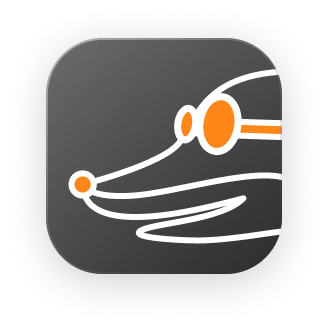
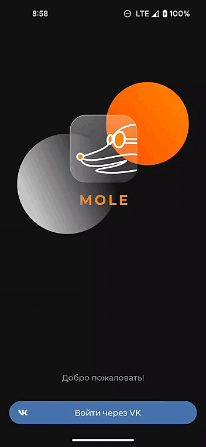

# Mole 

Mole - сервис для создания, сохранения и отслеживания истории долгов с вашими друзьями и знакомыми. Сходили вместе в ресторан или посетили интересное место? Тут вы сможете удобно разделить чек и ничего не забыть. Приложение исполнено в формате чата. Главной его ценностью является простота и прозрачность всех операций между пользователями. В этом репозитории находить код Android-клиента сервиса.

# Функционал

 * Создание долга
 * Закрытие долга
 * Просмотр истории долгов
 * Просмотр списка должников
 * Поиск пользователей
 * Добавление тега к долгу
 * Отображение баланса
 * Вход через ВКонтакте

# Планы развития

 * Рекоммендации на основе социального графа ВКонтакте
 * Вход через Google-аккаунт
 * Считывание информации с чеков
 * Интерактивное распределение позиций чека между пользователями
 * Редактирование профиля
 * Редактирование долга и история его изменения
 * Персонализация профиля

# How to contribute

Если у вас есть идеи по развитию проекта или исправлению недочётов, то мы с удовольствием их рассмотрим. 
Работа над проектом идёт на [GitLab](https://gitlab.com/mole-app/mole-android).

# Авторы

Mole-team
 * Android: [Ярослав](https://github.com/yaroslavok), [Александр](https://github.com/PaladiRka), [Оля](https://github.com/omy-q)
 * iOS: [Егор](https://github.com/EgorKolyshkin)
 * Backend: [Андрей](https://github.com/andreysoldatenkow)
 * QA: Виктория
 * Design: [Даниэль](https://instagram.com/polozovdaniel?igshid=YmMyMTA2M2Y=)
